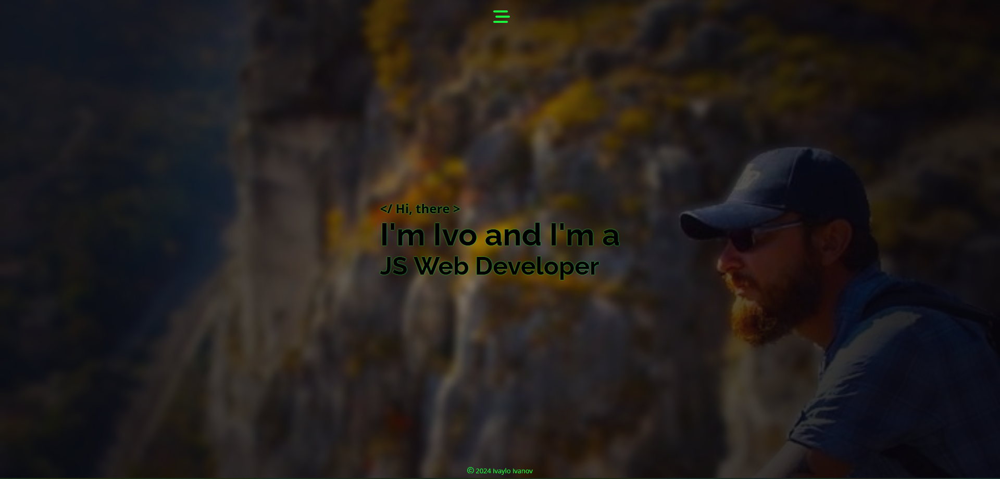

# Portfolio
This repository contains the client-side code for my portfolio website.

## Tech Stack

   

## Demo

View a demo of this app [here](https://ivaylo-ivanov-org.github.io). 👀

## 🚀 About "Portfolio" web app

The app is built using React, and it follows the React development concepts. It also uses TypeScript for better development and SCSS for styling and has a responsive design.

The application consists of a public part accessible without authentication. It features a single page with two links and several buttons that open different articles.

## ⚡ Features

 - the icons with an infinite rotation animation on the top left of the page lead to my LinkedIn and GitHub profiles.
 - the button on the left in the center of the page opens a contact form. When correctly filled out and submitted, the form sends an email to my email address and automatically sends a reply to the email specified by the sender, containing the data from the form and a message confirming successful submission. The form is served by a server I created using ExpressJS and Nodemailer. More information about this server can be found in this [repository](https://github.com/Ivaylo-St-Ivanov/Portfolio-server).
 - the button on the right in the center of the page opens a section showcasing the technologies I have studied.
 - the 'About me' button at the top right opens a section with brief information about me and some photos.
 - the "Portfolio" button in the upper right opens a section featuring some of my projects. For each project, a screenshot is displayed, and on hover (or touch if on a mobile device), the name of the project, a brief description, and button(s) leading to the repository and demo of the application (if available) are shown.

## Screenshot

## Run Locally

To run the project locally, a few environment variables need to be set.

## Author

- [@IVo](https://github.com/Ivaylo-St-Ivanov) 👋

## 🔗 Links

## Feedback

If you have any feedback, please reach out to me at ivailo.st.ivanov@gmail.com

## License

